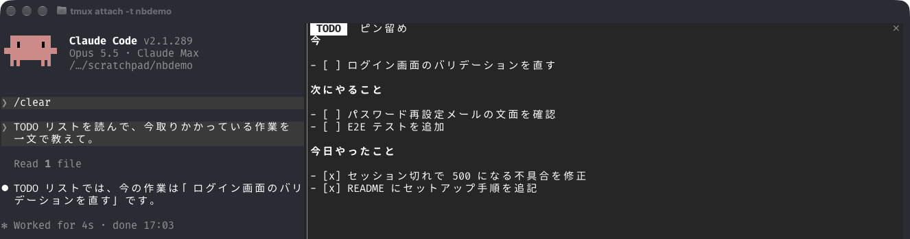

# todo-pane

[日本語](README.ja.md)

A plugin that keeps Claude's current task list in a pane next to the conversation.

During a long session in Claude Code, side trips and confirmations make it easy to lose track of what is being done now and what is left. With todo-pane installed, Claude writes each piece of work to the task list before starting it, and when it finishes, checks it off and moves it under "Done (date)". Look at the right-hand pane at any time to see the current work and what remains.



The pane has two tabs.

- TODO shows progress. Claude writes what it is doing now, what remains and what is done, and updates it as the work goes on. Things you are waiting to confirm or want to check later go here too, as part of the work.
- Pins (「ピン留め」 in Japanese) holds reference material you want to look back at while working: an explanation Claude gave, a comparison table, a summary of what you decided. Claude writes to it only when asked to pin something, and does not update it as work progresses.

Some ways to use pins:

- Ask Claude to explain how something works or walk through a procedure, then ask it to pin the answer. The answer stays beside the conversation instead of scrolling away.
- Ask Claude to pin research results such as URLs, commands and setting values. You can check them in the pane when needed instead of asking again.

Both tabs are plain Markdown files, one file per session. When Claude rewrites a file, the pane updates right away.

The pane and the instructions to Claude are implemented by a mod (a function hook that runs inside Claude Code) in the plugin. Mods arrived in Claude Code 2.1.287, so 2.1.287 or later is required.

## Install

```
/plugin marketplace add aromarious/claude-code-plugins
/plugin install todo-pane@aromarious
```

Right after installing, a "Configure todo-pane" screen appears. Skip it without entering anything and the files are created under the default `.claude`.

## Commands

| Command | Kind | What it does |
|---|---|---|
| `/todo-pane` | Mod command | Opens the TODO pane, or closes it if it is open. Opening creates the todo file if it is missing |
| `/todo-pane-pins` | Mod command | Opens the Pins pane, or closes it if it is open |
| `/todo-pane:pin [what to pin]` | Skill | Pins the main content of Claude's last reply. With text after it, pins what the text describes |

The ✕ button at the top right of a pane also closes it. Run the command again to reopen it.

## When the TODO pane is not visible

If Claude Code's own diff pane (the pane that shows git changes) is open, the TODO pane is hidden behind it, and running `/todo-pane` does not bring it forward. If the right side shows a list of changed files or "Diff unavailable", that is the diff pane. Run `/diff` or click the ✕ at its top right to close it.

The diff pane can open by itself in a git repository when the screen is wide. Once you close it with `/diff` or ✕, that state is saved as `diffSidebarOpen` in `~/.claude.json` and it no longer opens automatically.

## Components

| Component | Used | Files | Role |
|---|---|---|---|
| Function hook (mod) | Yes | `modules` in `hooks/hooks.json`, `hooks/register.tsx` | Draws the panes, adds instructions for Claude on every prompt, detects a missed update, provides the `/todo-pane` and `/todo-pane-pins` commands |
| Setting (`userConfig`) | Yes | `.claude-plugin/plugin.json` | Lets you change the directory `dir` where files are kept ([Settings](#settings)) |
| Commands | Yes | `hooks/register.tsx` | `/todo-pane` and `/todo-pane-pins`. Not command files; the mod registers them at startup |
| Skill | Yes | `skills/pin/SKILL.md` | `/todo-pane:pin`, which pins something to the Pins pane |
| Shell command hook | No | — | — |
| Command files, agents, MCP servers | No | — | — |

Claude Code has two kinds of hooks: hooks that run a shell command when an event occurs, and hooks that run a function inside Claude Code (mods). todo-pane uses function hooks only. `hooks/hooks.json` just tells Claude Code to load the module that holds them (`register.tsx`).

The mod registers functions for these events.

| Event | What it does |
|---|---|
| `session.start` | Detects the display language, opens the panes, starts re-reading the files every 3 seconds, and last registers `/todo-pane` and `/todo-pane-pins` (a name already taken does not stop the rest) |
| `prompt.submit` | On every prompt, attaches instructions for Claude that match the current state |
| `turn.start` | Remembers the contents of the todo file at the start of the turn |
| `tool.call` | Records whether a tool that changes files or Notion was called |
| `turn.complete` | If something was changed but the todo file was not, shows a notice and a status line |
| `command.run` | On `/todo-pane` or `/todo-pane-pins`, closes the pane if it is open, otherwise opens it and brings it forward. Opening with `/todo-pane` also creates the todo file if it is missing |
| `ui.close` | Remembers that a pane was closed (by a command or by ✕), so the next command opens it again |
| `skill.prompt` | When `/todo-pane:pin` runs, adds the session's pin file path to the skill text and opens the Pins pane |
| `ui.render` | Draws the pane contents (the Markdown of the todo file and the pin file) |

### External commands

The mod runs the following commands. All of them come with macOS and Linux. Windows has not been tested.

| Command | Purpose |
|---|---|
| `sh`, `ls`, `tail` | Read the last 500 lines of the session transcript (JSONL) to get the session name (every 3 seconds) |
| `rm` | Delete the old-name files when the session name changes and the files are renamed |

## Files shown

One file of each kind is kept per session, under `.claude/` relative to the directory where the session was started.

| File | Pane name | When it opens |
|---|---|---|
| `.claude/todo/<name>.md` | TODO | Always opens at session start |
| `.claude/pin/<name>.md` | Pins | Opens at session start if the file exists |
| `.claude/todo/done/<date>.md` | (no pane; the latest one is shown under the TODO tab) | Where the previous day's done items are moved when the date changes |
| `.claude/todo/<name>.off` | (no pane) | Records that you answered "don't create" in this session |

`<name>` is `<session name>-<first 6 characters of the session ID>` when the session has a name, and the first 8 characters of the session ID otherwise. `/`, `\`, `:` and control characters in the session name are replaced with `_`. Emoji and Japanese are kept as they are.

The pane re-reads the files every 3 seconds. A closed pane can be reopened with `/todo-pane` or `/todo-pane-pins`, and the ✕ button at the top right of a pane closes it, just like running the command again.

The session name comes from the latest `custom-title` line in the session transcript (JSONL). When the name changes mid-session, `<name>` is recomputed during the 3-second re-read, and the existing todo, pin and off files are moved to the new name.

## When the date changes

The date in the todo file's "## Done (YYYY-MM-DD)" heading (in Japanese, "## やったこと（YYYY-MM-DD）") is today's date in local time. When the date changes, at the next prompt or pane re-read, the contents of the previous day's done section are moved to `<dir>/todo/done/<date>.md` and the todo file's heading is changed to today's date. In the destination file they go under a "## Session <name>" heading. There is one file per date, shared by the sessions in the same directory. The older "## 今日やったこと" heading is read as the dated heading. A done heading in any language is accepted, and the heading written afterwards is in the current language.

Under the TODO tab, a divider follows the todo file, then the completed items of the most recent earlier day, up to the last 5. If there are more than 5, a line "…and N more" with the location of the source file is added. This is display only; it is not written to the todo file.

## Settings

One setting can be changed. It is a path relative to the working directory; an absolute path also works. A changed setting takes effect from the next session.

| Setting | Default | Meaning |
|---|---|---|
| `dir` | `.claude` | Directory that holds `todo/` and `pin/` |

Write the value in `pluginConfigs` in `~/.claude/settings.json`. The key is `todo-pane@aromarious` when installed from the marketplace, and `todo-pane` or `todo-pane@inline` when loaded with `--plugin-dir`.

```json
{
  "pluginConfigs": {
    "todo-pane@aromarious": {
      "options": { "dir": "out" }
    }
  }
}
```

With this example, the files are `out/todo/<name>.md`, `out/pin/<name>.md` and `out/todo/<name>.off`.

## Instructions to Claude

Every time you send a prompt, the following instructions are attached after it and passed to Claude. They are not shown on screen and the prompt text is not changed. They are rebuilt for every prompt, so they reflect the current state, such as whether the todo file exists or whether the session name changed.

The instructions are written in English. The headings in them follow Claude Code's `language` setting (see [Display language](#display-language)): "## Now" and "## Done (date)" in English, "## 今" and "## やったこと（日付）" when the language is Japanese. The instructions also tell Claude to write the items in the language you are writing in, so talking to Claude in Japanese gives Japanese items. The instructions say:

- The session's todo file is the TODO list shown in the right-hand pane.
- Write every item as a checkbox: `- [ ] ` for open, `- [x] ` for done. Never use a plain `- ` bullet.
- Before starting any work that changes files or Notion, first write it under the "now" heading of the todo file.
- When the work is done, check it and move it under the "done (today's date)" heading, and keep remaining items in their sections.
- When the topic changes, update the "now" section to match.
- Write the items in the language the user is writing in.

For pins, the following instruction is attached every time, whether or not the todo file exists and whether or not you answered "don't create".

- When asked to pin something ("pin that", 「ピン留めして」), write the target (the explanation, comparison table, summary, etc. just given) as Markdown to the session's pin file, creating it if missing. This is the pin tab of this plugin's side pane, not claude.ai Artifact pinning. The instruction also mentions the `/todo-pane:pin` skill. Write only when asked; do not update it as work progresses.

If a turn changed files or Notion but the todo file did not change, a notice and a status line tell you, and Claude is told to bring the todo file up to date at the start of the next turn. Changes made by subagents are not counted.

## Display language

Tab titles, todo-file headings, empty-pane placeholders, the previous-day block and notices follow Claude Code's `language` setting. If `language` names one of the supported languages below, they are in that language; otherwise they are in English. English names, native names and codes all work, in any case (`German`, `Deutsch`, `de`; `Traditional Chinese`, `繁體中文`, `zh-TW`; `pt-BR`). A plain `Chinese` or `中文` is Simplified. The check runs once, at session start.

Supported languages: English, Japanese (日本語), Simplified Chinese (简体中文), Traditional Chinese (繁體中文), Korean (한국어), Spanish (Español), French (Français), German (Deutsch), Portuguese (Português), Italian (Italiano) and Russian (Русский). Other languages are welcome: please open an [issue](https://github.com/aromarious/claude-code-plugins/issues) or a pull request. The strings are in the `L` table at the top of `hooks/register.tsx`.

The table shows the Japanese and English wording as examples.

| Item | Japanese | English |
|---|---|---|
| Now heading | `## 今` | `## Now` |
| Done heading | `## やったこと（date）` | `## Done (date)` |
| Pin tab title | ピン留め | Pins |
| Previous-day heading | `#### 前の日（date）` | `#### Previous day (date)` |
| Done file title | `# date にやったこと` | `# Done on date` |
| Done file session heading | `## セッション <name>` | `## Session <name>` |
| Missed-update notice | `<file> が更新されていません` | `<file> was not updated` |

The date rollover described above recognises the done heading of any supported language (`## Done (YYYY-MM-DD)`, `## やったこと（YYYY-MM-DD）`, `## Erledigt (YYYY-MM-DD)`, and so on). Any other heading is left alone, even one that ends with a date, such as `## Meeting notes (2026-10-01)`. A newly written heading uses the current language.

## When there is no todo file

In a session that has no todo file of its own, Claude asks in the first turn whether to create one. The question is asked once per session.

- If you say yes, Claude creates the session's todo file with the "now" and "done (today's date)" headings (in the language from the table above).
- If you say no, Claude creates an empty file `<dir>/todo/<name>.off` and does not ask again in this session.

In either case, running `/todo-pane` creates a todo file containing only the "## Now" and "## Done (today's date)" headings (Japanese equivalents when the language is Japanese) and shows it in the pane. It also deletes the `.off` file, so you can start using it with `/todo-pane` even after answering "don't create".
